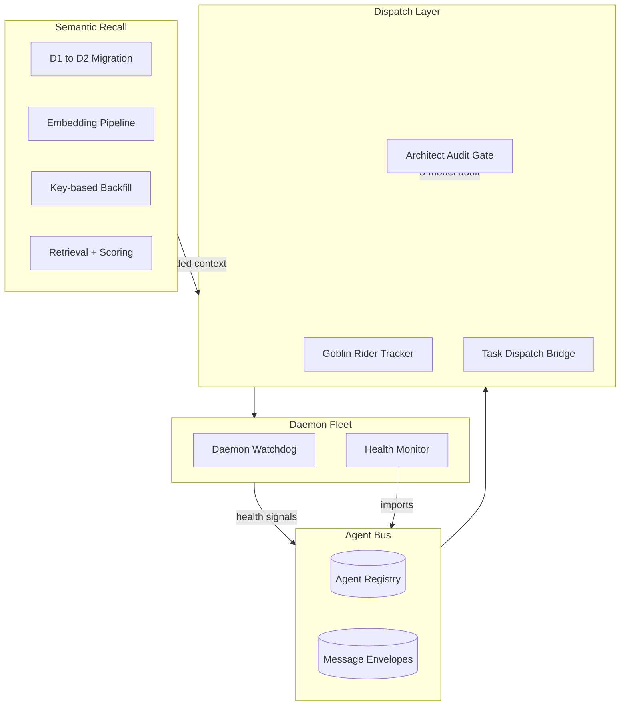

# Great Sage

Selected components of a multi-agent autonomous system that runs on a Mac Mini. The full system coordinates a fleet of background daemons, dispatches coding sub-agents, and answers questions against years of the operator's own conversation history using semantic recall. This repository contains the parts of that system that stand on their own and carry no private data.

This is a portfolio slice, not the whole machine. Business logic, personal content, credentials, and the private orchestration loop are not included. What is here is real code that runs in production on the author's hardware, scrubbed of secrets and reduced to the pieces that show the architecture.

## What this is

Four subsystems, wired in a line:

1. **Agent bus** gives every daemon a shared address book and a message envelope format, so components coordinate without importing each other.
2. **Dispatch** hands work to the right executor: background coding riders, a video queue, or a content generator, and tracks each job to completion.
3. **Daemons** run continuously and are watched by a health layer whose whole job is to prove that other daemons produce output, not just stay alive.
4. **Semantic recall** turns a personal archive of conversations into a searchable index, so any agent can ask "what did I decide about X" and get grounded context back.



## The pieces

### Agent bus (`src/gs_agent_bus.py`)

The protocol layer. A daemon imports it, registers its capabilities, and gets a message queue keyed to its name:

```python
bus = AgentBus("shion")
bus.register(capabilities=["academic", "canvas", "email"])
bus.send(to="efreet", msg_type="request", capability="video_gen", payload={...})
messages = bus.poll()   # returns envelopes addressed to this agent
```

Registry and messages live in Cloudflare D1 with a local SQLite fallback, so the bus keeps working when the network is down. Messages carry a TTL and expire on the next poll. The health monitor in this repo imports this module directly, which is the simplest proof that it works.

### Dispatch layer

- **`src/goblin_dispatch.py`** tracks background coding sub-agents (called Goblin Riders). It records each rider's start, watches for heartbeat and timeout, and logs completion state to D1. Run modes: `--status`, `--timeout-check`, `--report`, `--init`.
- **`src/task_dispatch_bridge.py`** polls a priority queue and routes each task to the right executor based on who it is assigned to: a video queue, a content generator run through the local coding CLI, or a skip for tasks handled elsewhere. It marks tasks through their lifecycle from pending to done.
- **`src/gs_architect.py`** is the code-modification gate. The system is allowed to propose changes to itself, but never to deploy them unattended. A proposal has to pass an audit by three separate models before it is queued for a human to sign off. No approval, no deploy.

### Daemon fleet

- **`src/gs_health_monitor.py`** runs continuously under launchd. It scans installed agents, flags restart loops, stale logs, and silent failures (a log file that has stopped growing is treated as a failure even if the process is alive). This is the "output, not uptime" rule in code.
- **`src/daemon_watchdog.py`** is the lighter-weight scanner. It parses launchctl state, detects restart-loop risk from throttle settings, spots daemons that touch D1 too aggressively, and prints an actionable report or a compact boot summary.

### Semantic recall

A pipeline that took a personal archive out of one Cloudflare database (D1, named sage-prism) and into a second one (D2, named sage-codex) with vector embeddings attached, then serves ranked recall against it.

- **`src/d2_migrate.py`** moves the codex tables between databases through the wrangler CLI.
- **`src/codex_to_chromadb.py`** is the embedding pipeline. It reads conversations, messages, transcripts, and browsing records, embeds them with OpenAI `text-embedding-3-small`, and writes vectors to ChromaDB for local semantic search.
- **`src/build_missing_by_key.py`** and **`src/chunk_exec_bykey.py`** are the repair pair. An earlier migration matched rows by primary key and silently dropped anything whose ids collided. These identify the genuinely missing chunks by content key (conversation id plus chunk index, not row id), rebuild idempotent `INSERT OR IGNORE` statements, and execute them in chunks with per-statement retry so one malformed row cannot sink a batch.
- **`src/codex_retrieval.py`** is the query side. It scores candidate messages by keyword match and recency (a 365-day half-life), pulls the best few turns per conversation, and returns a grounded context block an agent can act on.

## Design rules the code follows

- **Output, not uptime.** A daemon that runs but produces nothing is a failure. The health layer checks for produced output, not a live process.
- **Degrade, do not die.** The bus falls back to local SQLite when D1 is unreachable. The backfill retries statement by statement. Idempotent writes mean a re-run is always safe.
- **Self-modification is gated.** The Architect can write proposals. Three models audit them. A human signs off. There is no path from "the system had an idea" to "the system changed itself" without a person in the loop.

## Setup

Everything reads its configuration and secrets from environment variables. Nothing is hardcoded.

```bash
python3 -m venv .venv && source .venv/bin/activate
pip install -r requirements.txt
cp .env.example .env      # then fill in your own values
```

Set the variables from `.env.example` in your shell (or a process manager). The Cloudflare pieces expect the `wrangler` CLI to be installed and authenticated separately.

Most components are meant to run as launchd agents on macOS or as long-lived processes anywhere. The recall scripts run on demand.

## Scope and honesty

- This is a subset. The private orchestration loop, the business logic, and the operator's actual data are not in this repository.
- The names (Great Sage, Goblin Riders, Shion, Efreet) come from the running system. They are labels, not products.
- Secrets are read from the environment. The example bridge URL is a placeholder. Point the variables at your own infrastructure to run it.

## License

MIT. See [LICENSE](LICENSE).
